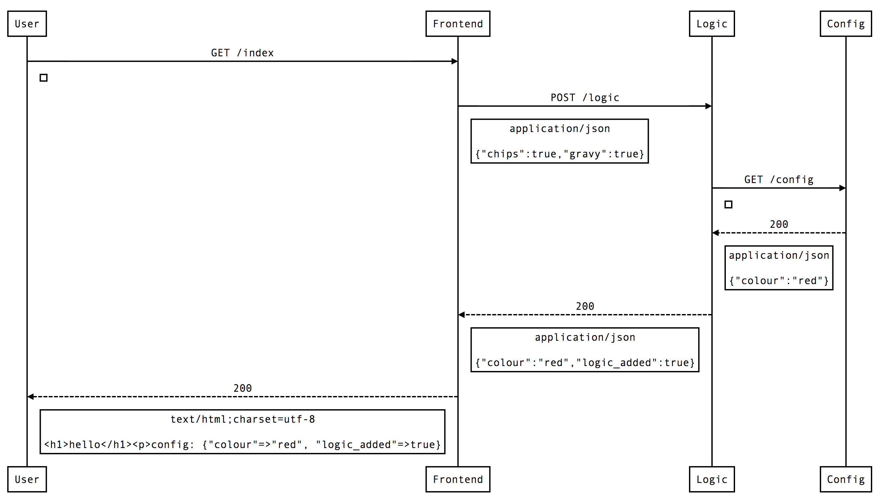

Introduction
------------

The interactions between microservices in applications often evolve to be hard to understand. This tool allows you to generate sequence diagrams of the as-is interactions between microservices. It does this by capturing the traffic between the different microservices when they are all running on a single host.



Prerequisites
-------------
You need to have wireshark's command-line application (tshark) in your path. To install it on Mac, run:

    brew install wireshark

or visit [the website](https://www.wireshark.org/download.html).

Wireshark must be on the path, and able to listen to your local loopback interface (lo0). You may need to run the interaction diagram script with sudo to enable it to do this.

You should also ensure you have all required gem dependencies after a pull. From the root directory, run:

    bundle install

This has been tested with versions 1.12.5 and 1.99.6 of wireshark on OS X.

### Configuring loopback device

You need to ensure you have permission to capture on the loopback device.  If you don't then you will see output from `./generate_html.rb` like this:

```sh
Recording network traffic. Press ENTER to stop...
tcpdump: lo0: You don't have permission to capture on that device
((cannot open BPF device) /dev/bpf0: Permission denied)
``` 

Usage
-----
You need to include a YAML configuration file named "participants.yml" in the root directory. List the HTTP clients and servers you wish to capture, in the order you wish them to appear. The format is as follows:

```yaml
    - name: <name of first participant>
      user_agent: <user agent header value used by participant when it makes http requests> [optional, defaults to <name>]
      port: <port participant listens on>
    - name: User
    - name: <name of second participant>
      port: <port participant listens on>
```

By default this tool expects there to be "Starting testClass.testName" and "Finishing testClass.testName" events in the packet stream it captures.  That can be disabled by passing in the `-n` option.

To ignore any service not listed in your participants.yml file pass in the `-f` option

A special participant named "User" can be placed anywhere in the configuration file to indicate where traffic from the browser should appear in the diagram.

For usage information, run:

    ./generate_html.rb --help

Command Line Options
--------------------

By default this tool expects there to be "Starting testClass.testName" and "Finishing testClass.testName" events in the packet stream it captures.  That can be disabled by passing in the `-n` option.

To ignore any service not listed in your participants.yml file pass in the `-f` option

To use a `participants.yml` file that is not in the current directory pass it in after the `-r` options

Test Service
------------
 To demo the tool using a test service:
  
  * run `./test_service/capture.sh`
  * visit http://localhost:8000/index
  * press enter in the console to complete capture, generate the diagram and open it in a browser
  